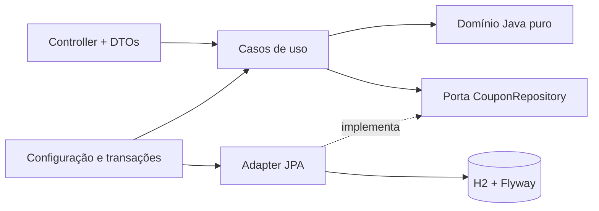

# Coupon API

API Java para cadastrar, consultar e excluir cupons, com regras em objetos de domínio independentes do Spring e do JPA.

Validação: 111 execuções Java, 98,01% de linhas cobertas, núcleo com 100% de linhas/branches e 29/29 mutantes detectados no CI. Consulte o relatório para escopo e evidências.

[Contrato analisado](docs/ANALISE-CONTRATO.md) · [Plano técnico](docs/PLANO-TECNICO.md) · [Testes e TDD](docs/TDD-EXECUCAO.md) · [Validação](docs/VALIDACAO.md)

## Executar em poucos passos

**Docker:** Docker Engine/Desktop com Compose v2 e Python 3. O Python é usado apenas pelos utilitários de demonstração, sem dependências externas.

```bash
python scripts/demo.py configure
docker compose up --build --wait
python scripts/demo.py smoke
```

O primeiro comando cria uma senha aleatória em `.env` e preserva uma configuração existente. Se preferir dispensar Python, copie `.env.example` para `.env` e substitua a senha por um valor de 12 a 72 bytes.

**Java local:** JDK 21 e Python 3; Maven é instalado automaticamente pelo wrapper.

```bash
# Linux/macOS; no PowerShell use .\mvnw.cmd clean verify
./mvnw clean verify
python scripts/demo.py configure
python scripts/demo.py run
```

- Swagger UI: http://localhost:8080/swagger-ui/index.html
- OpenAPI: http://localhost:8080/v3/api-docs
- Readiness: http://localhost:8080/actuator/health/readiness

No Swagger, execute `POST /auth/token` com o usuário e a senha do seu `.env`. Copie apenas o `accessToken` para **Authorize**, escolha o exemplo de criação e execute `POST /coupon`. O exemplo gera uma expiração futura quando a documentação é carregada. Use o `id` retornado para consultar e excluir.

O servidor local usa a porta 8080. Para o Compose, `COUPON_PORT` no `.env` permite mudar a porta publicada. O H2 é **em memória**: cupons são descartados ao encerrar a aplicação. Para finalizar o ambiente de demonstração: `docker compose down`.

## Contrato e regras

| Operação | Sucesso | Comportamento |
| --- | --- | --- |
| POST /auth/token | 200 | JWT RS256, duração padrão de 15 minutos |
| POST /coupon | 201 + Location | Cadastra e retorna o cupom |
| GET /coupon/{id} | 200 | Consulta cupom não excluído |
| DELETE /coupon/{id} | 204 sem corpo | Exclusão lógica |

```json
{
  "code": "AB-12!CD",
  "description": "Cupom de demonstração",
  "discountValue": 0.5,
  "expirationDate": "2030-12-31T23:59:59Z",
  "published": false
}
```

A resposta de criação/consulta contém exatamente `id`, `code`, `description`, `discountValue`, `expirationDate`, `status`, `published` e `redeemed`.

- O código perde os caracteres que não sejam letras ASCII ou dígitos; **depois** precisa ter exatamente seis caracteres. `AB-12!CD` vira `AB12CD`. Não há truncamento ou conversão para maiúsculas.
- Desconto é um valor absoluto, mínimo 0,5, sem teto de negócio, porcentagem ou arredondamento monetário. Usa `BigDecimal`.
- Data em ISO 8601 com offset, convertida para UTC. Não pode estar no passado na criação; igualdade com o instante atual é aceita.
- `published` ausente assume `false`; `null` explícito é inválido. Cupom novo tem `status=ACTIVE` e `redeemed=false`.
- Exclusão preserva dados e registra `deletedAt`. É permitida para cupons expirados, publicados ou resgatados.
- Consulta de excluído retorna 404; segunda exclusão retorna 409. Duas exclusões concorrentes não produzem dois sucessos.

**Decisões locais, além do enunciado:** códigos repetidos são permitidos; a especificação não exige unicidade. Expiração não muda automaticamente o status para INACTIVE. JWT e os erros abaixo são extensões solicitadas/documentadas. A análise do Apidog encontrou documentação, sem URL de servidor de produção: não há alegação de ter medido uma API remota.

## Erros previsíveis

Erros usam `application/problem+json` (Problem Details), com `type`, `title`, `status`, `detail`, `instance`, `code` e `correlationId`. Erros de validação de campos também incluem `errors`.

| Status | Situação |
| --- | --- |
| 400 | JSON/tipo/UUID inválido, campo obrigatório ausente |
| 401 | Credencial ou JWT inválido/ausente |
| 403 | Token válido sem a permissão exigida |
| 404 | Cupom inexistente ou excluído na consulta |
| 405 / 406 / 415 | Método, Accept ou Content-Type incompatível |
| 409 | Exclusão repetida ou conflito de versão |
| 413 | Corpo acima de 64 KiB |
| 422 | Código, desconto, descrição ou expiração viola regra; número fora da representação suportada |
| 429 | Limite de tentativas de autenticação; inclui Retry-After |
| 500 | Erro inesperado, sem detalhes internos na resposta |

O domínio retorna motivos de negócio sem conhecer HTTP. O advice traduz exceções dos controllers; `AuthenticationEntryPoint` e `AccessDeniedHandler` usam a mesma fábrica de erros na cadeia de segurança. Os filtros têm responsabilidades concretas: correlação e limite do corpo.

## Arquitetura e escolhas



Um módulo Maven, separado por funcionalidade. `Coupon`, `CouponCode` e `DiscountValue` protegem invariantes. `CouponJpaEntity` representa persistência; records representam comandos, snapshots e DTOs. Casos de uso recebem `Clock` e gerador de UUID por injeção, permitindo testar limites temporais sem sleeps.

MapStruct possui configuração central, injeção por construtor e erro de compilação para campos de destino não mapeados. Decorators definem as transações fora dos casos de uso. A exclusão usa atualização condicional por versão: somente uma requisição vence; sucesso só é registrado depois do commit.

Flyway cria o schema e o Hibernate apenas o valida. Não há `ddl-auto=update`, console H2 ou Open Session in View. Constraints protegem estados estruturais; a validação temporal da criação permanece no domínio.

**Precisão finita é uma restrição de representação:** H2 `DECFLOAT(1000)`, até 1.000 dígitos significativos e expoente decimal ajustado entre -1.000 e 1.000. Isso não introduz um teto comercial. A entrada HTTP rejeita representações fora desse intervalo com 422, sem arredondar silenciosamente. O parser também limita tamanho e profundidade do JSON.

## Segurança e operação

Spring Security Resource Server valida assinatura RS256, emissor, audiência, expiração obrigatória e validade temporal, com tolerância de relógio de 30 segundos. As permissões são `coupon:read` e `coupon:write`. API stateless; emissão de token tem headers `no-store` e limite global de 20 tentativas por minuto por instância.

O perfil **demo** gera chaves RSA efêmeras em memória. Reiniciar invalida os tokens anteriores. O usuário de demonstração é configurado pelo ambiente; a senha é verificada com BCrypt e não tem valor padrão no artefato.

Sem o perfil demo, a inicialização exige `COUPON_SECURITY_PRIVATE_KEY` e `COUPON_SECURITY_PUBLIC_KEY` apontando para resources PEM (PKCS#8 e X.509), além da senha. Nunca publique chaves ou `.env`. Essa emissão local é um recurso de demonstração; uma implantação real deve definir identidade externa, HTTPS, rotação de chaves e limitação distribuída conforme a necessidade.

Logs correlacionam método, rota, status e duração com `X-Correlation-ID`; registram sucesso de criação/exclusão após commit. Credenciais e tokens têm `toString` redigido. Os scripts verificam ausência de ERROR, token, senha e marcador de payload nos logs da execução exercitada.

O container executa como usuário sem privilégios, filesystem somente leitura, capabilities removidas, diretório temporário limitado e healthcheck. A imagem base está fixada por digest.

## Verificar a entrega

```bash
./mvnw clean verify
python -m unittest discover -s scripts -p 'test_*.py'
python scripts/verify_runtime.py
# Mutação do domínio/casos de uso; executada no CI Linux:
./mvnw -Pmutation org.pitest:pitest-maven:mutationCoverage
```

`verify` executa unitários, testes HTTP, integração com H2/Flyway, segurança JWT, concorrência, ArchUnit, formatação e JaCoCo. O build exige 80% de linhas no projeto e 90% de linhas/branches em cada package do núcleo. Apenas classes geradas pelo MapStruct são excluídas. O PIT exige 80% de mutantes detectados nos objetos de domínio e serviços de aplicação.

Relatórios ficam em `target/site/jacoco/index.html`, `target/pit-reports/index.html`, Surefire e Failsafe. O verificador do JAR usa credenciais descartáveis, porta livre, 16 verificações HTTP e encerra o próprio processo. Resultado sanitizado: `tmp/runtime/result.json`.

No Windows, o helper direciona sockets temporários da JVM para `tmp` do projeto, contornando uma falha de acesso ao AppData observada neste ambiente. O PIT também deve ser executado em checkout Linux/ASCII para evitar a falha de carregamento de classes observada no caminho Windows com acentos.

O GitHub Actions valida o JAR, mutação, build da imagem, Compose, HTTP e logs. Relatórios são publicados como artifacts; logs brutos e credenciais permanecem fora do repositório.

## Apresentar em cinco minutos

1. Execute a API e demonstre criar, consultar, excluir e repetir a exclusão.
2. Mostre a normalização e a fronteira de 0,5 nos testes do domínio.
3. Mostre a diferença entre `Coupon` e `CouponJpaEntity`, com o teste ArchUnit.
4. Mostre exclusão concorrente, rollback e o log emitido após commit.
5. Abra os relatórios de testes, cobertura e mutação; explique as decisões locais e os limites da demonstração.

Stack fixada: Java 21, Spring Boot 4.1.1, MapStruct 1.6.3, springdoc 3.1.1, JaCoCo 0.8.15, ArchUnit 1.5.0 e PIT 1.30.0. Demais versões seguem o BOM do Spring Boot.
