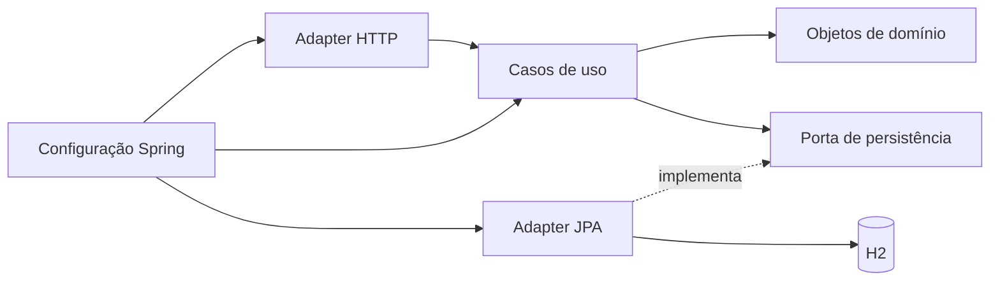

# Plano técnico da Coupon API

Preparado em 11/09/2026, antes de codificar. O texto abaixo preserva o plano original; a implementação seguiu estas etapas. Escolhas efetivas e comandos estão no README; resultados de execução estão em VALIDACAO.md e TDD-EXECUCAO.md.

O objetivo é entregar uma solução de nível pleno, fácil de executar e de defender tecnicamente. O diferencial será demonstrar fidelidade às regras, tratamento de falhas e evidência de qualidade. O plano contempla testes escritos antes das classes de produção, implementação incremental, execução real da aplicação, inspeção dos logs e publicação em GitHub com branch e merge para main.

Consulte também a análise do contrato e a matriz de testes, na mesma pasta. As escolhas não explicitadas no desafio estão identificadas como decisões locais nesses documentos.

**1. Escopo e prioridades**

| Prioridade | Entrega | Critério de sucesso |
| --- | --- | --- |
| P0 | Três endpoints e regras do enunciado | Mesmos caminhos, campos e status de sucesso; todas as RN cobertas |
| P0 | Domínio independente, H2 em memória, testes, Docker/Compose e Swagger | Atender integralmente ao nível pleno |
| P1 | JWT e permissões, erros padronizados, records/DTOs e mappers | Pedidos explícitos do usuário com testes |
| P1 | Flyway, transações, proteção contra exclusão simultânea | Integridade demonstrável no banco real do desafio |
| P1 | CI, logs correlacionados, smoke test do JAR e container, README | Recrutador consegue reproduzir a entrega |
| P2 | Teste de mutação e roteiro curto de apresentação | Reforçar a avaliação depois que P0/P1 estiverem concluídos |

Ficam fora desta entrega endpoints de listagem, atualização, resgate, publicação posterior e restauração, porque não constam do contrato. Também não há caso concreto para microsserviços, mensageria, Redis, event sourcing, CQRS, cadastro completo de usuários ou Kubernetes. Evoluções futuras podem ser discutidas no README sem virar dependências da execução.

**2. Stack proposta e verificação de compatibilidade**

| Item | Escolha | Motivo e verificação |
| --- | --- | --- |
| Java | 21 LTS | Já disponível; records, APIs de tempo e tipos adequados sem recursos preview |
| Build | Maven + Maven Wrapper | Execução reprodutível no Windows, Linux e CI |
| Base | Spring Initializr, candidato Spring Boot 4.1.1 | Versão estável oferecida na consulta; fixar a versão no POM gerado |
| HTTP | Spring MVC | Três operações síncronas sobre persistência bloqueante |
| Dados | Spring Data JPA + H2 em memória | JPA apenas no adapter; requisito de H2 preservado |
| Migrações | Flyway | Criação versionada do schema e validação pelo Hibernate |
| Segurança | Spring Security Resource Server + JOSE/Nimbus | Verificação JWT pela infraestrutura padrão |
| Mapping | MapStruct, candidato estável 1.6.3 | Mapeamento verificável na compilação |
| API docs | springdoc-openapi, candidato 3.1.1 | Linha 3.x destinada ao Boot 4; validar combinação exata no build |
| Testes | JUnit Jupiter gerenciado pelo Boot, AssertJ, Mockito, Spring Test | Testes unitários rápidos e integração direcionada |
| Qualidade | JaCoCo e ArchUnit; PIT como reforço posterior | Cobertura e limites arquiteturais verificáveis |
| Operação | Actuator, logs estruturados, Docker e Compose | Diagnóstico e execução demonstráveis |

Fontes consultadas: [Initializr](https://start.spring.io/metadata/client), [requisitos do Spring Boot](https://docs.spring.io/spring-boot/system-requirements.html), [springdoc](https://springdoc.org/), [MapStruct](https://mapstruct.org/documentation/stable/reference/html/), [JWT no Spring Security](https://docs.spring.io/spring-security/reference/servlet/oauth2/resource-server/jwt.html) e [H2 no Flyway](https://documentation.red-gate.com/flyway/reference/database-driver-reference/h2).

O Initializr retornou Boot 4.1.1 como estável padrão e também 4.0.8; não serão usados snapshots ou milestones. A página do springdoc declara suporte da linha 3.x ao Boot 4, mas sua tabela detalhada consultada ainda lista 4.0.x/3.0.x. Por isso a combinação 4.1.1/3.1.1 é candidata, não compatibilidade comprovada por execução. A fase inicial deve validar dependências, imports, serialização, test slices e Swagger. Havendo incompatibilidade real, usar combinação estável documentada e registrar a decisão.

Versões transitivas devem seguir o BOM do Boot. Bibliotecas fora dele terão versão explícita. Não fixar manualmente Hibernate, Jackson ou Spring Security sem necessidade demonstrada. O projeto usará a família de APIs correspondente ao Boot escolhido, evitando exemplos antigos de outra versão.

**3. Arquitetura e direção das dependências**

Um único módulo Maven, organizado por funcionalidade e por limites internos. As interfaces existem onde há fronteiras e substituição reais. Domínio e aplicação serão Java puro; infraestrutura implementa as portas e monta os objetos por injeção de construtor.



Estrutura proposta, ajustável somente se um teste ou uma responsabilidade concreta justificar:

```text
com.maraujo.couponapi
  CouponApiApplication
  coupon
    domain
      model          Coupon, CouponCode, DiscountValue, CouponStatus
      exception      BusinessRuleViolation e motivos de domínio
    application
      port/in        CreateCouponUseCase, GetCouponUseCase, DeleteCouponUseCase
      port/out       CouponRepository
      command        CreateCouponCommand
      service        CreateCouponService, GetCouponService, DeleteCouponService
      exception      CouponNotFoundException, ConcurrentCouponModificationException
    adapter
      in/web         CouponController
        dto          CreateCouponRequest, CouponResponse
        mapper       CouponWebMapper
      out/persistence
        entity       CouponJpaEntity
        repository   SpringDataCouponRepository
        mapper       CouponPersistenceMapper
        adapter      JpaCouponRepositoryAdapter
  auth
    web              TokenController, TokenRequest, TokenResponse
    service          Autenticação e emissão de token da demonstração
  shared
    web/error        GlobalExceptionHandler, ProblemDetailFactory, FieldViolation
    web/filter       CorrelationIdFilter
  infrastructure
    transaction      Decoradores transacionais dos casos de uso de escrita
    security         AuthenticationEntryPoint, AccessDeniedHandler
  config
    mapper           MapperConfiguration
    security         SecurityConfiguration, JwtProperties
    persistence      Configuração necessária de persistência
    observability    Configuração necessária de logs
    ClockConfiguration, UseCaseConfiguration, OpenApiConfiguration
```

Os nomes indicam responsabilidades, não uma exigência de criar uma classe para cada diretório. Não haverá `BaseService`, `BaseController`, repositório genérico próprio ou interfaces que apenas dupliquem classes sem necessidade.

SOLID será evidenciado por casos de uso pequenos, domínio responsável pelo comportamento, portas específicas e dependências apontando para dentro. Clean Code será evidenciado por nomes de negócio, métodos curtos quando isso melhora a leitura, imutabilidade quando apropriada, ausência de estado global e ausência de comentários que apenas repitam o código.

**4. Modelo e regras de domínio**

| Tipo | Responsabilidade |
| --- | --- |
| `CouponCode` | Record/value object: remover caracteres fora do alfabeto escolhido, validar seis caracteres e expor valor normalizado |
| `DiscountValue` | Record/value object: BigDecimal não nulo e >=0,5; preservar valor exato; sem regra percentual |
| `Coupon` | Classe com construção controlada; validar criação, manter dados e executar exclusão lógica |
| `CouponStatus` | Enum com valores do contrato; sem estado extra inventado |
| `CreateCouponCommand` | Record sem dependências HTTP, transportando entrada do caso de uso |
| `CreateCouponRequest` | Record de transporte, com validação estrutural e desserialização controlada |
| `CouponResponse` | Record com exatamente os campos do contrato de sucesso |
| `CouponJpaEntity` | Representação persistente, com anotações JPA e metadados de concorrência |

`Coupon` terá operações de criação e exclusão; não disponibilizar setters que permitam contornar regras. Objetos de valor devem ser válidos desde sua construção. Se `DiscountValue` precisar de igualdade numérica independente de escala, normalizar sua representação ou explicitar essa semântica em teste, porque BigDecimal.equals e compareTo têm comportamentos distintos.

Capturar o instante corrente uma única vez por operação, a partir de `Clock` injetado no caso de uso. O domínio recebe o instante como parâmetro e não consulta o relógio do sistema. Assim expiração, criação e exclusão não variam entre chamadas internas do mesmo fluxo.

A reconstituição de uma linha existente não pode chamar a factory de criação que exige data não passada. O cupom expira com o tempo, mas continua sendo um registro carregável e excluível. Reconstituição preserva invariantes estruturais e consistência de estado, sem reaplicar precondições temporais exclusivas do cadastro.

Soft delete altera o status para `DELETED` e registra `deletedAt`, preservando os campos do cadastro e o identificador. Não impedir a exclusão por estar publicado, expirado ou resgatado, já que o enunciado permite excluir a qualquer momento.

**5. Records, validação e mappers**

Records serão usados para dados e value objects imutáveis; entidade JPA continuará classe. O agregado deve favorecer comportamento e invariantes, sem ser convertido em um saco de dados apenas para usar um recurso moderno.

A borda HTTP valida forma e presença. O domínio valida significado. Exemplo: desconto ausente/null é 400; um número presente abaixo de 0,5 é 422. Descrição não nula porém em branco é regra de domínio. A mesma regra não deve ser copiada em controller, service e mapper.

O package `config.mapper` conterá configuração compartilhada do MapStruct, com component model Spring, injeção por construtor e `unmappedTargetPolicy=ERROR`. Ignorar campos exige decisão explícita. Não usar reflexão de um mapper genérico para preencher entidades silenciosamente. [Configuração e políticas do MapStruct](https://mapstruct.org/documentation/stable/reference/html/).

O mapper HTTP converte request para command e domínio para response. O mapper de persistência preserva o estado completo e chama reconstituição adequada; não decide validade temporal, status ou exclusão. A versão de concorrência deve acompanhar o registro lido até sua atualização, como metadado da porta/adapter, sem dependência do domínio em JPA.

**6. H2 com Flyway e integridade**

H2 é suportado pelo Flyway. O banco padrão será em memória; Flyway aplica migrações em cada instância nova e mantém histórico dentro daquela instância. Isso não torna os dados duráveis após parar o processo. Essa limitação deve constar no README. [Suporte oficial](https://documentation.red-gate.com/flyway/reference/database-driver-reference/h2).

Planejar `V1__create_coupon_table.sql` e novas versões apenas se houver evolução real. Configurar `ddl-auto=validate`, `open-in-view=false`, credenciais por configuração e console H2 desabilitado por padrão. Não misturar `schema.sql`, geração automática de tabelas e migrações como três autoridades concorrentes.

Persistir UUID, código normalizado, descrição, desconto, expiração, status, published, redeemed, createdAt, deletedAt e version. Incluir NOT NULL e checks estáticos de integridade coerentes com o domínio. Não criar CHECK dependente de CURRENT_TIMESTAMP: um cupom pode envelhecer validamente no banco. Não criar UNIQUE em código sem requisito correspondente.

Precisão exige uma prova específica antes de escolher o DDL final. `NUMERIC` do H2 usa escala padrão zero; uma coluna monetária de duas casas também não decorre do enunciado. O teste `CouponPersistenceIT` deverá persistir e reler 0,5, 0,5001, valores grandes e diversas escalas. Avaliar `DECFLOAT` com precisão explícita e suporte do Hibernate como candidato, porque H2 o mapeia para BigDecimal; fixar o tipo e seus limites técnicos depois de provar o round-trip. Nenhuma solução será aceita com arredondamento silencioso. [Tipos numéricos do H2](https://h2database.com/html/datatypes.html#numeric_type).

Também testar precisão de datas entre HTTP, Java e H2. Quando necessário, definir precisão temporal explicitamente no schema. Limites do parser e de representação numérica são controles técnicos documentados, não um desconto máximo comercial. Excesso deve gerar erro claro, não overflow, consumo descontrolado de memória ou 500.

Fronteiras transacionais ficam em decoradores de infraestrutura para criação e exclusão. O adapter preserva a versão observada e usa `@Version` ou atualização condicional equivalente, verificada no teste de concorrência. A exceção de concorrência deve ser traduzida na fronteira apropriada para 409. A transação precisa ter concluído antes de responder sucesso.

O caminho de exclusão deve conseguir ler registros excluídos. Um filtro global de soft delete que esconda tudo impediria identificar a segunda exclusão. Consultas de negócio ocultam excluídos explicitamente; inspeção de integridade e exclusão usam busca interna adequada.

**7. Tratamento HTTP e de falhas**

Preservar os status de sucesso documentados e adicionar `Location: /coupon/{id}` ao 201. A tabela detalhada de erros está no documento de análise. A resposta de sucesso continuará sem envelope, mantendo desconto numérico e nomes de campos.

Usar `@RestControllerAdvice` com `ResponseEntityExceptionHandler` para erros MVC e exceções da aplicação. Uma factory comum monta ProblemDetail e seus campos adicionais. `ErrorCode`/motivos de domínio identificam falhas; o domínio não conhece HttpStatus. O handler escolhe o HTTP correspondente. [Suporte do Spring a ProblemDetail](https://docs.spring.io/spring-framework/reference/web/webmvc/mvc-ann-rest-exceptions.html).

Falhas de autenticação/autorização ocorrem também antes do controller. Configurar `AuthenticationEntryPoint` e `AccessDeniedHandler` para reutilizar a mesma factory de resposta, preservando os headers relevantes. O advice sozinho não resolve essas falhas.

Um filter próprio é justificável para correlação e diagnóstico: receber identificador válido ou gerar um novo, devolver no header, colocar no MDC e limpar em finally. Limitar comprimento e caracteres aceitos para impedir injeção em logs. Posicionar antes da autenticação para também correlacionar 401/403. Não escrever um filtro JWT próprio que repita a validação do Spring Security.

O fallback de erro inesperado gera 500 genérico para o cliente e registra causa com stack trace uma única vez no servidor. Não capturar Exception indiscriminadamente para continuar uma operação ou responder 200. Mensagens de banco, senhas, JWTs e stack traces não entram na resposta.

**8. JWT utilizável pelo avaliador**

Proteger os três endpoints de cupom com Bearer JWT. Permissões propostas: `coupon:read` para consulta e `coupon:write` para criação/exclusão. São extensões explícitas solicitadas pelo usuário, já que o contrato original não define autenticação.

Usar Resource Server e JwtDecoder para verificar assinatura, algoritmo esperado, emissor, audiência e validade temporal. Não aceitar `alg=none`, assinatura incorreta ou token apenas decodificado. [Documentação oficial](https://docs.spring.io/spring-security/reference/servlet/oauth2/resource-server/jwt.html).

Para a demonstração ser autocontida, incluir `POST /auth/token` com credenciais configuradas e verificadas por PasswordEncoder/BCrypt, retornando `accessToken`, `tokenType` e `expiresIn`. Permissões são atribuídas pelo servidor; o cliente não escolhe scopes no login. Não implementar cadastro, refresh token ou reset de senha sem caso de uso.

Assinatura proposta RS256 com JwtEncoder. Chaves de demonstração podem ser geradas em memória no startup de um perfil demo explícito; o README explicará que os tokens deixam de valer ao reiniciar. Fora desse perfil, configuração deve exigir chaves apropriadas. Nunca commitar chave privada, token utilizável ou senha real. A configuração local de exemplo usa placeholders; instruções/scripts de execução ajudam o recrutador a configurar credenciais.

Sessão stateless. CSRF pode ser desabilitado apenas para a API que autentica por Bearer, sem autenticação por cookie. CORS só deve liberar origens necessárias. Swagger e health terão política explícita; token endpoint deve aplicar proteção simples contra tentativas excessivas no modo de demonstração, com resposta 429 e limites testados. Essa proteção local não será apresentada como solução distribuída.

Os testes devem incluir assinatura real. Utilizar apenas o suporte `jwt()` do Spring Test não comprova verificação criptográfica nem validade temporal. Para a suíte unitária, o serviço de emissão/verificação terá relógio e dados determinísticos, sem sleeps.

**9. Estratégia TDD e qualidade**

Cada comportamento seguirá o ciclo: escrever teste; executar e observar falha relevante; implementar o mínimo necessário; executar novamente; refatorar mantendo testes verdes. Não criar antecipadamente controllers, entities e services para depois acrescentar testes. O scaffold e a configuração do build são preparação, não implementação das regras.

Quando o primeiro teste referenciar um tipo inexistente, a falha inicial de compilação é esperada. Criar a menor assinatura possível e obter uma falha de asserção para a regra antes da implementação, sem fabricar evidência de RED retroativamente. Commits de entrega podem agrupar ciclos já verdes, evitando publicar uma main quebrada apenas para exibir TDD.

| Camada | Ferramenta | Evidência procurada |
| --- | --- | --- |
| Domínio | JUnit Jupiter + AssertJ, testes parametrizados | Fronteiras e transições sem Spring nem banco |
| Aplicação | JUnit + Mockito/fakes pequenos de portas | Orquestração, ausência de escrita em falhas, propagação adequada |
| HTTP | MockMvc/test slice | Status, headers, JSON, validação e tradução de exceções |
| Segurança | Testes de cadeia real e JWT assinado | Autenticidade, expiração e autorização |
| Persistência | H2 real + Flyway | Migrações, round-trip, soft delete, transação e concorrência |
| Arquitetura | ArchUnit | Domínio/aplicação sem Spring/JPA/HTTP, sem ciclos indevidos |
| Aplicação empacotada | Smoke test com porta real | JAR/container utilizáveis fora do contexto de teste |

Meta de JaCoCo: no mínimo 90% de linhas e 90% de branches em domínio/aplicação, além de no mínimo 80% de linhas no conjunto de código autoral. O percentual não substitui o teste explícito de cada regra. Exclusões só para código gerado e justificadas; não excluir handlers e regras difíceis para elevar números.

PIT, se compatível com as versões finais, verificará mutações relevantes: trocar >= por > no desconto, inverter comparação de data, retirar normalização ou permitir segunda exclusão. Examinar sobreviventes antes de afirmar qualidade. Não transformar essa etapa em requisito que adie correções do contrato ou runtime.

**10. Sequência de execução e critérios de saída**

| Fase | Testes escritos primeiro | Implementação subsequente | Critério de saída |
| --- | --- | --- | --- |
| 0. Preparar | Smoke de contexto/contrato mínimo; arquitetura antes de camadas | Scaffold pelo Initializr, Wrapper, dependências e estrutura | Build reproduzível, versões fixadas e nenhuma regra antecipada |
| 1. Domínio | CouponCodeTest, DiscountValueTest, CouponTest | Value objects, criação, reconstituição e exclusão | Todas as RN do domínio verdes, sem frameworks |
| 2. Aplicação | Create/Get/DeleteCouponServiceTest | Casos de uso e portas necessárias | Falhas não escrevem, estados corretos e relógio controlado |
| 3. Persistência | MigrationIT, CouponPersistenceIT, ConcurrentDeleteIT | Flyway, JPA adapter, mappers e transações | Dados exatos, exclusão lógica e concorrência demonstradas |
| 4. HTTP | CouponControllerTest, GlobalExceptionHandlerTest, MapperTest | Records, controllers, mappers e handlers | 201/200/204 e erros definidos; schema de resposta fiel |
| 5. Segurança | TokenServiceTest, JwtSecurityIT, SecurityErrorContractTest | Emissão, decoder, permissões e handlers de segurança | 401/403 corretos; acesso autenticado funcionando |
| 6. Operação | CorrelationIdFilterTest, LogSanitizationTest, smoke de health | Correlação, logs, Actuator, Swagger e scripts | Falhas rastreáveis, sem dados sensíveis e docs executáveis |
| 7. Empacotar | Smoke do JAR/container e assertions do contrato | Dockerfile, Compose, workflow e README | Processo real inicia, atende e termina corretamente |
| 8. Publicar | Reexecutar gates no conteúdo final | Repositório público, push, PR e merge | Checks verdes, main contém entrega e URLs verificadas |

A implementação de cada fase também respeita TDD internamente. Dependências inevitáveis são montadas incrementalmente; um teste web inicial pode rodar com caso de uso substituído, mas a validação final deve usar a cadeia completa. Atualizar a matriz com resultados reais ao longo do trabalho.

**11. Execução real e análise de logs**

Ao finalizar as classes e sempre que a integração revelar problema, executar os testes apropriados e corrigir a causa. A conclusão exige também um processo fora dos testes.

Sequência final planejada:

1. Executar `./mvnw clean verify` no Linux/CI e `./mvnw.cmd clean verify` no Windows; conferir relatórios de testes e cobertura.
2. Iniciar o JAR com configuração demo explícita e aguardar health com timeout; falhar se o processo morrer ou não ficar pronto.
3. Obter token e criar cupom válido com expiração futura dinâmica; verificar 201, Location e campos; consultar o id e comparar dados.
4. Excluir e verificar 204 sem corpo; consultar e verificar 404; repetir exclusão e verificar 409.
5. Exercitar amostras de 400, 422, 401 e 403; conferir ProblemDetail e correlação em todos os caminhos aplicáveis.
6. Verificar Swagger/OpenAPI e confirmar que os exemplos podem ser executados com autenticação.
7. Conferir preservação física dos dados pelo teste de integração, sem criar endpoint administrativo para consultar o banco.
8. Encerrar o processo de teste; subir `docker compose up --build -d`, aguardar health, repetir o fluxo e inspecionar logs; finalizar containers da execução de teste.
9. Registrar comandos, versões, resultados e limitações reais no relatório de validação; repetir etapas afetadas por qualquer correção.

O H2 deve ficar embutido na aplicação; Compose não precisa de um serviço H2 separado. Dockerfile deve fazer build em estágio separado e executar com usuário sem privilégios. O healthcheck só pode chamar uma ferramenta presente na imagem final. Usar base e versão fixadas, contexto pequeno e `.dockerignore` coerente.

Logs planejados: timestamp UTC, nível, serviço, correlationId, método, rota, status e duração; eventos relevantes com couponId e resultado. INFO para conclusão operacional, WARN para situação que merece atenção, ERROR com stack trace para falha inesperada. Falhas esperadas de validação não precisam gerar stack trace por requisição. Registrar sucesso de alteração só após commit.

Inspecionar explicitamente: falhas/warnings de migração; divergências de schema; configurações de segurança inesperadas; serialização; respostas 500 no fluxo nominal; erros duplicados; ausência de correlação em 401/403; tokens, senhas, descrições e payloads completos em logs. Encontrar problema implica corrigir, reproduzir o cenário e analisar novamente.

Não incluir couponId, JWT ou correlationId como tags de métricas de alta cardinalidade. Endpoints operacionais devem expor apenas o necessário, sem detalhes sensíveis de configuração.

**12. GitHub, branch, CI e merge**

Destino sugerido: repositório público `Maraujo999/coupon-api`. A consulta não encontrou esse nome acessível na conta, mas a disponibilidade será reconfirmada ao criar. Branch de implementação: `codex/coupon-api`; destino final: `main`.

O diretório já tem Git inicializado, sem commits, sem remote e com branch inicial master. Planejar um commit inicial de documentação/build mínimo em main e criar a branch de implementação a partir dele. A configuração de identidade local deve usar a conta pessoal/noreply apropriada; não reutilizar automaticamente a identidade corporativa herdada do Git global nem alterar configurações globais.

Fluxo de entrega:

1. Preparar main inicial e branch local; commits pequenos de etapas concluídas, com mensagens claras e testes verdes nos pontos de entrega.
2. Criar repositório público pela conta autenticada, conectar origin e publicar main e a branch.
3. Criar PR com problema, comportamento entregue, decisões de contrato e validação real. Não citar cobertura ou comandos que não foram executados.
4. CI executa Maven verify, publica relatórios, verifica build de container e smoke com Compose. Usar permissões mínimas do workflow e ferramentas de versão fixada; não expor secrets de execuções.
5. Revisar diff e corrigir falhas. Aguardar checks do commit mais recente, sem ignorar falha apenas porque uma execução antiga passou.
6. Mergear PR em main, preferindo preservar histórico útil dos commits. O usuário já pediu criação, publicação e merge; não existe necessidade de reconfirmar essas ações como etapa de rotina.
7. Buscar a main remota, confirmar commit/conteúdo final e CI correspondente. Entregar URL do repositório, PR e evidências de validação.

Antes da publicação, conferir arquivos versionados: somente código, testes, documentação própria e configuração segura. Não adicionar o PDF, screenshots do desafio, arquivos temporários, logs brutos, `.env`, chaves ou artefatos de build por acidente. Não executar `git add .` sem revisar o conjunto.

**13. Estado do ambiente e dependências de execução**

| Item inspecionado | Situação observada |
| --- | --- |
| Java/Javac | Java 21.0.7 disponível |
| Maven | 3.9.11 disponível; entrega usará Wrapper |
| Git | Repositório inicial vazio, sem remote |
| GitHub CLI | Autenticado na conta Maraujo999 com capacidade de repositório/workflow |
| Docker CLI | 28.4.0 disponível |
| Engine Docker | Não respondeu; pipe do Docker Desktop Linux Engine ausente |
| Base de produção da Coupon API | Não informada no OpenAPI consultado |

Na execução, verificar/iniciar o Docker Desktop e repetir o diagnóstico do engine antes de validar Compose. Se houver impedimento externo real, registrar a limitação e concluir os testes do JAR enquanto se resolve; não declarar container validado sem execução. Não há motivo para bloquear a implementação do domínio por esse estado inicial do Docker.

Não existem logs de aplicação ou resultados de unitários nesta etapa, porque ainda não há implementação. A inspeção realizada foi do material e das ferramentas locais.

**14. Definição de pronto**

- Todas as regras RN01-RN10 atendidas e ligadas a testes identificáveis.
- Testes escritos antes do código correspondente, com ciclos de falha/correção efetivamente executados.
- Domínio distinto de JPA, limites de arquitetura verificados e DTOs sem vazamento de entidades.
- Contrato de sucesso compatível; erros e decisões adicionais documentados; JWT utilizável.
- H2/Flyway funcionais, persistência exata, soft delete e concorrência comprovados.
- Cobertura acima dos limites definidos, com relatório real e sem exclusões oportunistas.
- JAR e Compose executados com fluxo real de criação, consulta e exclusão; problemas encontrados corrigidos.
- Logs revisados, sem falhas inexplicadas e sem dados sensíveis.
- README contém pré-requisitos, comandos, token, exemplos, decisões, limitações do H2 e formas de testar.
- Repositório público e PR entregues; merge em main e checks do estado final confirmados.

O roteiro para a entrevista deve demonstrar um sucesso, uma falha de domínio e uma exclusão repetida; abrir um teste representativo; mostrar a separação domínio/JPA; explicar uma ambiguidade do contrato e apresentar a execução reproduzível. Esses exemplos demonstram responsabilidade sobre a aplicação sem aumentar artificialmente seu escopo.
